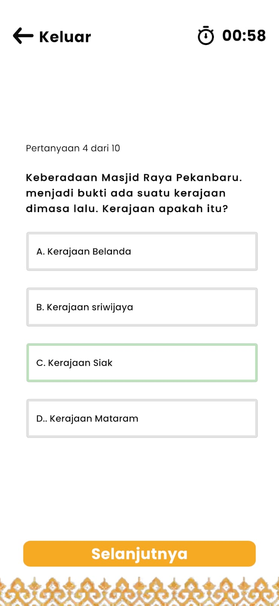
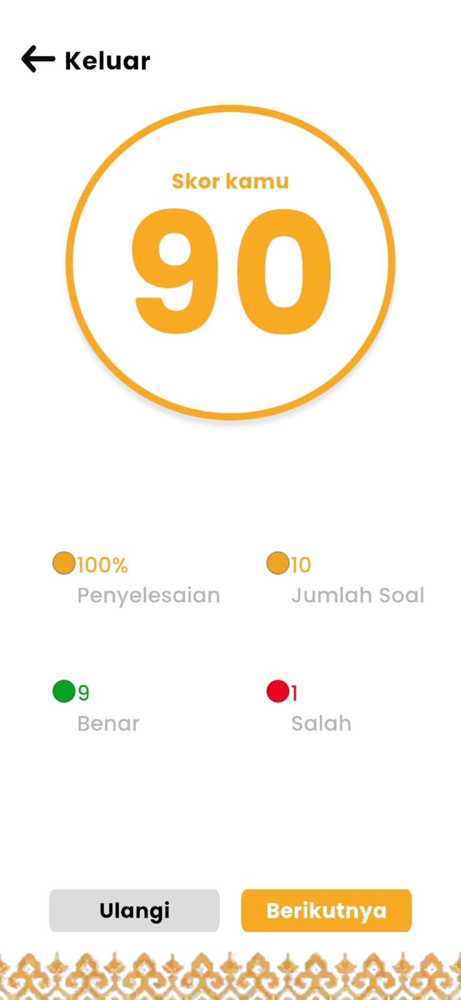

# PekanAR 📱🕌

**PekanAR** adalah aplikasi Augmented Reality berbasis Android yang bertujuan untuk mengenalkan berbagai landmark kota Pekanbaru

Aplikasi ini menggunakan teknologi **AR (Augmented Reality)** berbasis **Marker-based** dan **Geospatial** yang dikembangkan menggunakan **Unity + ARFoundation**, serta menampilkan model 3D yang dibuat dengan **Blender**.

---

## 📦 Status Proyek
🚧 Proyek ini masih dalam tahap pengembangan sebagai bagian dari **Tugas Akhir/Skripsi**.  
Kode sumber akan dipublikasikan setelah proses akademik selesai.

---

## 🔗 Demo Aplikasi (APK Build)
📥 Unduh file APK melalui Google Drive:  
👉 [Download PekanAR APK](https://drive.google.com/drive/folders/1_I6AklNfGXnN4EKsAGeLr-NXE4q3mOa_?usp=drive_link)

> ⚠️ Pastikan Anda mengizinkan instalasi aplikasi dari sumber tidak dikenal di perangkat Android Anda.

---

## 🧩 Teknologi yang Digunakan
- Unity + ARFoundation (ARCore backend)
- Blender (3D Modeling)
- C#
- Android Build Support

---

## 🎯 Fitur Utama
### Deteksi marker untuk menampilkan landmark dalam bentuk 3D

<table>
  <tr>
    <td></td>
    <td></td>
  </tr>
</table>

### Integrasi informasi edukatif tiap landmark
<table>
  <tr>
    <td></td>
  </tr>
</table>

### Kuis interaktif berbasis landmark yang dikunjungi
<table>
  <tr>
    <td></td>
    <td></td>
  </tr>
</table>

### Dukungan untuk navigasi berbasis lokasi (Geospatial API)
> ⚠️ Dalam proses pembuatan

---

## 🏛️ Landmark yang Ditampilkan
### ✅ Sudah tersedia
- Masjid Raya Annur
- Jembatan Siak IV
- Perpustakaan Soeman HS 
- Tugu Songket Melayu
- Rumah Singgah Tuan Kadi
### 🚧 Dalam proses pembuatan
- Tugu Zapin 
- Stadiun Utama Riau
- Anjung Seni Idrus Tintin 
- Politeknik Caltex Riau
- Monumen Perjuangan 
- Masjid Raya Kota Pekanbaru 
---
